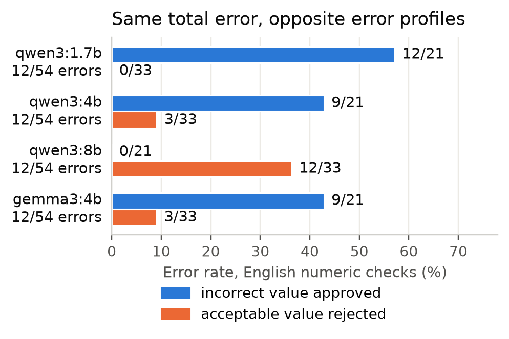

# APEX-Invariance: who grades the grader?

Research proposal and reproducible preliminary experiments by Santiago Martínez Novoa for the Mercor Research Fellowship, Novel Evaluation Methodology.

**Which kinds of work will a new APEX judge grade more reliably, and where will it introduce errors?** The proposed evaluation follows rubric criteria through controlled changes to professional deliverables, then tests whether diagnosing those changes improves grading decisions or review cost.

## Read the proposal

- [One-page pitch (PDF)](submission/APEX-Invariance%20-%20One-Page%20Pitch.pdf)
- [Full proposal (PDF)](submission/APEX-Invariance%20-%20Full%20Proposal.pdf): methodology, preliminary results, workplan, hypotheses and sixteen references
- [Research hypotheses](proposal/Hypotheses.md) and [references](proposal/References.md)

## Check the supporting evidence

The [evidence guide](analysis/README.md) connects the proposal's numerical claims to recorded results and reproduction scripts. Preparation includes an audit of 100 public tasks, 19 source-reproduced numeric criteria and 2,394 valid local judgments across four studies.

These studies use constructed controls and local Qwen/Gemma judges. They establish test cases and limitations of the instrument; they do not establish failures in Mercor's reference judge. The complete records retain negative results, repeated calls and failed attempts. Independent professional validation and testing on natural agent responses are proposed fellowship work.

## Reproduce the results

See [REPRODUCING.md](REPRODUCING.md) for offline analysis, figure generation and verification. Recomputing results from recorded outputs requires no model calls or API credentials.

| Directory | Supporting material |
|---|---|
| [submission/](submission/) | The two proposal PDFs |
| [proposal/](proposal/) | Hypotheses, cited bibliography and experimental protocols |
| [analysis/](analysis/) | Claim-to-evidence guide, reports and numerical results |
| [experiments/](experiments/) | Study configurations and prompt variants |
| [runs/](runs/) | Frozen requests, raw responses, manifests and model identities |
| [data/](data/) | Pinned public APEX development data, source files and upstream harness excerpts |
| [scripts/](scripts/), [tests/](tests/) | Experiment and analysis code with verification tests |
| [figures/](figures/) | Figures supporting the proposal and detailed reports |

The public development data come from [Mercor's APEX-v1-extended release](https://huggingface.co/datasets/mercor/APEX-v1-extended), revision e0db9513115f8d0449591fac3d77d4bdc1a98fef. Original attribution, source manifests and the upstream harness license are retained under data/. No hidden evaluation cases or internal Mercor trajectories are included.

## License and citation

Code under `scripts/` and `tests/` is MIT licensed (`LICENSE`). The proposal, pitch, protocols, reports and figures are licensed CC BY-NC-ND 4.0 (`LICENSE-CONTENT.md`): share them unchanged with attribution; no derivatives or commercial use without permission. Redistributed APEX data and Mercor's public scoring code keep their own terms, included alongside them. Cite with `CITATION.cff`. First public version: 14 September 2026; the commit history dates every component.
