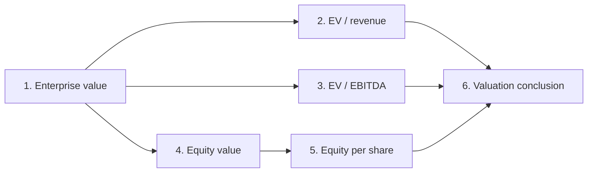

# Public APEX development-set audit

Generated by `python3 scripts/audit_apex.py`. No LLM runs or human judgments are included.

Source: [mercor/APEX-v1-extended](https://huggingface.co/datasets/mercor/APEX-v1-extended/tree/e0db9513115f8d0449591fac3d77d4bdc1a98fef).
Revision: `e0db9513115f8d0449591fac3d77d4bdc1a98fef`; CSV SHA-256: `71b241d2884457534856a831b640a0e4de7734c9a8f46b7d35174ee4b74320c9`.

**100 tasks; 1,140 criteria; 541 criteria with declared dependencies across 93 tasks.**

| Domain | Tasks | Criteria | With dependencies | Primary objectives | Primary share |
|---|---:|---:|---:|---:|---:|
| Consulting | 25 | 242 | 111 | 181 | 74.8% |
| Finance | 25 | 232 | 110 | 80 | 34.5% |
| Legal | 25 | 247 | 82 | 178 | 72.1% |
| Medicine | 25 | 419 | 238 | 349 | 83.3% |

## What deserves follow-up

1. **A concrete propagation example.** Task 2108 criterion 1 has five downstream criteria in the declared graph. Under equal criterion scoring, its own label is 16.7 points; the criterion plus all reachable descendants cover 100 points. This is structural exposure, not evidence that one error actually causes all six failures. Compare matched responses with a seeded upstream error and inspect which labels change.
2. **Priority and scoring are different metadata.** Finance marks 80/232 criteria as primary objectives; Medicine marks 349/419. This is an item-pooled descriptive contrast, not the average task score. Compare the canonical score with a separately labeled primary-objective diagnostic on the same responses; neither is automatically the better measure.
3. **Reasoning is not the opposite of numeric.** All 11 criteria in task 2287 are tagged only Reasoning, including its numerical IRR, MOIC and NPV requirements. Keep criterion_type and add an independently reviewed numerical-versus-semantic scoring-mode annotation. Do not infer that distinction from the original tags.
4. **Metadata is not human evaluation coverage.** The human_rating field contains 1,136 false and four true values. Without a schema definition and linked responses/raters, these values do not establish how many items were human graded.
5. **Representation is not organizational evidence.** The two orderings of the Extraction/Reasoning pair occur 423 and 138 times. Normalize as sets for analysis; this does not establish whether Mercor has previously analyzed them.

## Five candidate pilot families

| Task | Domain | Criteria | Declared edges | Largest downstream set | Starting criterion |
|---|---|---:|---:|---:|---:|
| 1172 | Consulting | 6 | 3 | 3 | 1 |
| 1242 | Consulting | 13 | 19 | 8 | 1 |
| 2108 | Finance | 6 | 7 | 5 | 1 |
| 2145 | Finance | 10 | 11 | 3 | 2 |
| 2287 | Finance | 11 | 0 | 0 | 1 |

## A traceable dependency example: task 2108

Arrows show the rubric's declared prerequisite relationships. All five other criteria are reachable from enterprise value; this graph does not show observed model failures.

## Graph integrity

Invalid/self references: 0; tasks with cycles: 0.

Declared dependency edges motivate clustered analysis. They do not demonstrate a violation of conditional independence, prove double counting, or quantify error propagation without response-level data.

## Scope

This is the 100-case public development set. It provides no access to the 400 hidden evaluation cases, historical trajectories, or internal human labels. Raw descriptions and fields are retained in apex_criteria.csv for traceability. The downloaded dataset card contains attribution and intended-use terms. No dataset content was used to train or tune a model.
