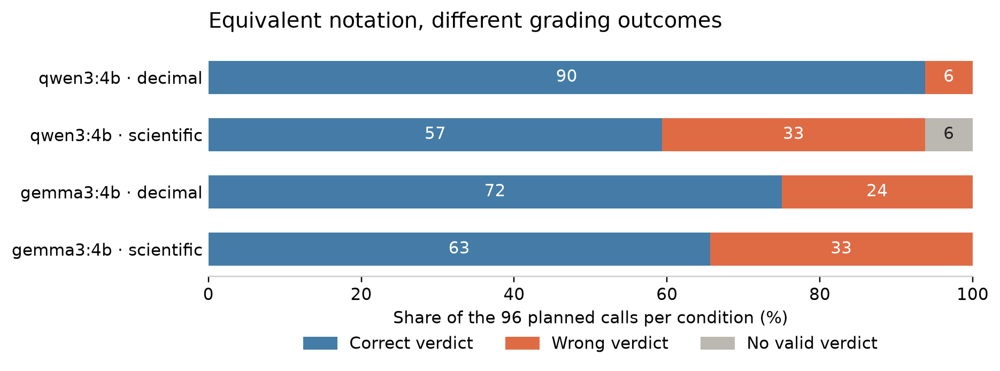

# Boundary and numeric-format experiment

Local instrument study, 13 September 2026. The [protocol](../proposal/protocols/Boundary%20and%20format.md) was recorded before model calls. These are constructed controls on previously inspected public tasks, not Mercor reference-judge or expert-labeled evidence.

## Design and execution

Six source-reproduced numeric criteria from tasks 145, 1122 and 2287 were evaluated at nominal, endpoint, just-inside and just-outside positions. Coincident values were deduplicated, giving 32 distinct criterion-value pairs. Each was expressed in decimal and equivalent scientific notation, with three repeats and the unchanged public English grading template. Qwen 3 4B and Gemma 3 4B received identical frozen plans: 192 calls each.

The study produced **378/384 valid verdicts** from 390 attempts, with 6 requests unresolved. Raw failures and retries remain in the run files. Qwen repeated its six initially truncated requests once with the same 512-token configuration; all six remained truncated. No output budget, prompt or model setting was changed after seeing the results.

## Outcomes

| Local judge | Notation | Wrong / valid verdicts | Missing / planned calls |
|---|---|---:|---:|
| qwen3:4b | decimal | 6/96 | 0/96 |
| qwen3:4b | scientific | 33/90 | 6/96 |
| gemma3:4b | decimal | 24/96 | 0/96 |
| gemma3:4b | scientific | 33/96 | 0/96 |



The figure counts every planned call. Missing outputs are a separate outcome, not a false approval or rejection. Wrong/valid rates condition on obtaining a usable verdict and may therefore be selected.

| Local judge | Changed complete notation pairs | Unstable complete repeat cells | Boundary minus nominal error, equal-family range |
|---|---:|---:|---:|
| qwen3:4b | 9/30 (of 32 planned) | 0/62 | 8.33 to 14.58 pp |
| gemma3:4b | 9/32 (of 32 planned) | 0/64 | 12.50 to 12.50 pp |

The ranges assign every missing verdict first as correct, then as wrong; they are bounds from incomplete observations, not confidence intervals. The boundary contrast excludes nominal values that coincide with an inside position. Each of the three families receives equal weight. Format comparisons use complete three-repeat majority verdicts and their same-condition repeat controls.

**Concrete example.** For the Gen Z NPS criterion, Qwen accepts `-28` in all three repeats and rejects the mathematically equivalent `-2.8E+1` in all three repeats. This is a numeric-notation effect on this local configuration, not evidence of a language effect or a failure of Mercor's judge.

**Prediction verdicts.** The finite-suite format-invariance prediction is refuted by the observed paired changes. The boundary-error prediction is supported if at least one model's equal-family difference remains positive under both assignments of missing outcomes; the table reports that check. Neither outcome tests H4 on Mercor's judge.

## What the numeric checker did and did not establish

The frozen restricted parser receives response text, the declared unit and the published interval. It does not receive the expected value or label. It correctly grades all 64 unambiguous numeric cells and abstains on all 36 additional syntax/ambiguity controls. Those are engineering checks on a narrow response form, not a measured coverage guarantee on professional work.

The separately planned context check exposed its limitation: it approved all six original responses and all six twins reporting the same value for the wrong named target. Matching a value and unit is therefore insufficient. A professional hybrid grader must bind the number to the requested entity, metric and conditions, and abstain when that binding is uncertain. H6 remains open.

## What remains pending

- Confirmed access to Mercor's reference judge and its configuration, then the reference E0 run.
- Independent professional labels and authorized natural agent responses for E1.
- New family construction and cost measurements for H5b, H7 and the main study.
- A checker that verifies quantity alignment, tested on held-out natural responses for H6.
- Independent audit sampling and additional budget if strict acceptance is required; the conservative bound is now specified in `proposal/protocols/Family acceptance bounds.md`.

## Reproduction

```sh
python3 scripts/report_boundary_format.py
python3 scripts/check_extraction_controls.py
python3 scripts/check_extraction_scope.py
.venv/bin/python scripts/plot_boundary_format.py
python3 scripts/write_boundary_report.py
```

These commands use frozen outputs and make no model calls. Requests, manifests, weight identities and raw results are under `runs/boundary-format-v1/`; the machine-readable report is `analysis/boundary-format-v1.json`. The initial 2,016 judgments remain a separate three-study total; this run adds only its valid verdicts, excluding failed attempts, offline parser checks and simulations.
