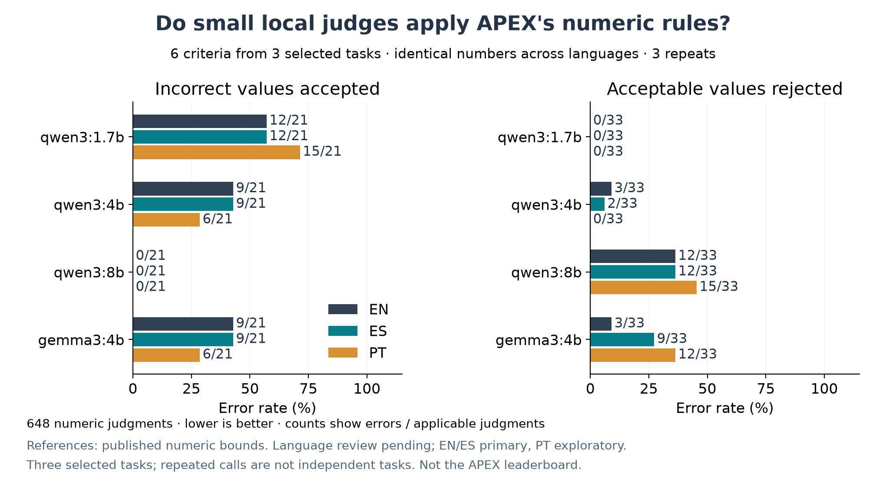
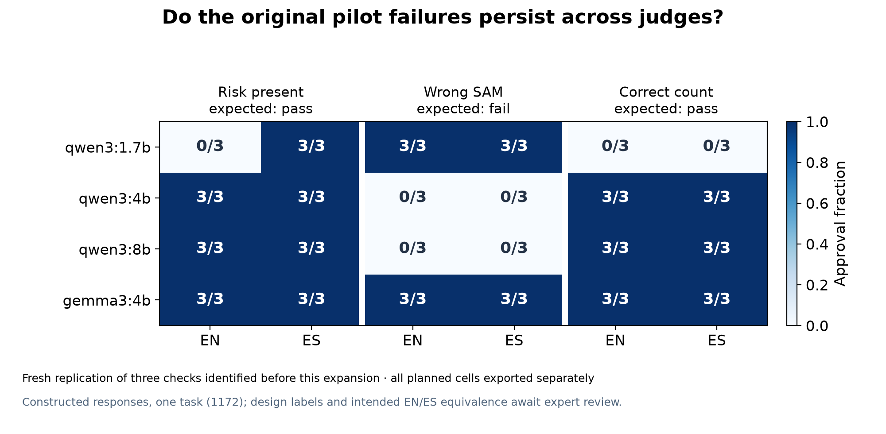

# Comparación local de jueces — resultados observados

**1080/1080 juicios válidos**, cuatro modelos locales y tres tareas fuente seleccionadas. Intentos fallidos registrados: 0. Las 108 llamadas del primer piloto son anteriores y no forman parte de este total.

El estudio incluye 432 llamadas de replicación sobre respuestas construidas de 1172 y 648 llamadas sobre seis predicados numéricos de 1172, 2287 y 2145. Cada modelo recibe exactamente el mismo plan. Inglés–español es la comparación principal; portugués es secundario y solo aparece en los controles numéricos.

## Aplicación de tolerancias numéricas

Una aprobación de un valor fuera del rango es un error; rechazar un valor permitido también lo es. Los denominadores cuentan juicios repetidos, no tareas independientes. Cada idioma tiene 21 juicios sobre valores incorrectos y 33 sobre valores aceptables por modelo.

| Modelo | Idioma | Incorrectos aprobados | Aceptables rechazados |
|---|---|---:|---:|
| qwen3:1.7b | EN | 12/21 (57.1%) | 0/33 (0.0%) |
| qwen3:1.7b | ES | 12/21 (57.1%) | 0/33 (0.0%) |
| qwen3:1.7b | PT | 15/21 (71.4%) | 0/33 (0.0%) |
| qwen3:4b | EN | 9/21 (42.9%) | 3/33 (9.1%) |
| qwen3:4b | ES | 9/21 (42.9%) | 2/33 (6.1%) |
| qwen3:4b | PT | 6/21 (28.6%) | 0/33 (0.0%) |
| qwen3:8b | EN | 0/21 (0.0%) | 12/33 (36.4%) |
| qwen3:8b | ES | 0/21 (0.0%) | 12/33 (36.4%) |
| qwen3:8b | PT | 0/21 (0.0%) | 15/33 (45.5%) |
| gemma3:4b | EN | 9/21 (42.9%) | 3/33 (9.1%) |
| gemma3:4b | ES | 9/21 (42.9%) | 9/33 (27.3%) |
| gemma3:4b | PT | 6/21 (28.6%) | 12/33 (36.4%) |

**El agregado oculta fallos distintos:** los cuatro modelos cometen 12/54 errores en los controles numéricos en inglés. La distribución entre aprobaciones incorrectas y rechazos incorrectos cambia con el modelo. El resultado permite comparar perfiles de error; no basta para declarar un ganador general o atribuir toda diferencia al tamaño.

## Diferencias entre idiomas e inestabilidad

Se compara cada combinación respuesta × criterio. Una diferencia de tasa de aprobación no implica por sí sola que el español o el portugués sea peor evaluado: depende de si debía aprobarse esa respuesta. Las diferencias opuestas pueden cancelarse al sumar errores, por lo que también se reportan pares individuales.

| Modelo | Bloque | Comparación | Pares con distinta aprobación | Desacuerdo entre idiomas, promedio | Desacuerdo dentro de EN / otro, promedio |
|---|---|---|---:|---:|---:|
| qwen3:1.7b | matched_response | EN/ES | 2/18 | 11.1% | 0.0% / 0.0% |
| qwen3:1.7b | numeric_probe | EN/ES | 2/18 | 11.1% | 0.0% / 0.0% |
| qwen3:1.7b | numeric_probe | EN/PT | 1/18 | 5.6% | 0.0% / 0.0% |
| qwen3:4b | matched_response | EN/ES | 0/18 | 0.0% | 0.0% / 0.0% |
| qwen3:4b | numeric_probe | EN/ES | 1/18 | 1.9% | 0.0% / 3.7% |
| qwen3:4b | numeric_probe | EN/PT | 2/18 | 11.1% | 0.0% / 0.0% |
| qwen3:8b | matched_response | EN/ES | 0/18 | 0.0% | 0.0% / 0.0% |
| qwen3:8b | numeric_probe | EN/ES | 0/18 | 0.0% | 0.0% / 0.0% |
| qwen3:8b | numeric_probe | EN/PT | 1/18 | 5.6% | 0.0% / 0.0% |
| gemma3:4b | matched_response | EN/ES | 0/18 | 0.0% | 0.0% / 0.0% |
| gemma3:4b | numeric_probe | EN/ES | 2/18 | 11.1% | 0.0% / 0.0% |
| gemma3:4b | numeric_probe | EN/PT | 4/18 | 22.2% | 0.0% / 0.0% |

Desacuerdo entre idiomas: probabilidad empírica de etiquetas distintas al cruzar todas las combinaciones de repeticiones del par. Desacuerdo dentro del idioma: pares de repeticiones distintas de la misma celda. Son estadísticas descriptivas de esta colección; no se tratan esas combinaciones como muestras independientes.

## Replicación de los fallos identificados en el primer piloto

Estos tres ejemplos se seleccionaron antes de ver la ampliación porque ya aparecían en el piloto inicial. El cuadro completo de 360 celdas está exportado, incluyendo resultados sin diferencias. El párrafo de riesgos se reutiliza en dos variantes: no son dos réplicas independientes del contenido.

| Modelo | C5 riesgo presente EN / ES | C4 SAM incorrecto EN / ES | C2 número correcto EN / ES |
|---|---:|---:|---:|
| qwen3:1.7b | 0/3 / 3/3 | 3/3 / 3/3 | 0/3 / 0/3 |
| qwen3:4b | 3/3 / 3/3 | 0/3 / 0/3 | 3/3 / 3/3 |
| qwen3:8b | 3/3 / 3/3 | 0/3 / 0/3 | 3/3 / 3/3 |
| gemma3:4b | 3/3 / 3/3 | 3/3 / 3/3 | 3/3 / 3/3 |

**Concordancia sin corrección:** gemma3:4b aprueba todos los criterios de todas las respuestas del bloque original, incluidas las variantes con SAM incorrecto y riesgo omitido. La concordancia EN/ES perfecta en ese bloque no implica que el juez sea fiable.

## Alcance de las conclusiones

- Se mide al juez, no la capacidad del modelo para resolver las tareas APEX. Las respuestas numéricas son frases construidas que contestan un criterio concreto.
- Los valores de referencia provienen de las reglas publicadas. Existen cálculos independientes previos para 1172 y 2287. Durante esta ampliación también se reprodujo 2145 C1 desde 252 precios del PDF: beta 0,6079237, redondeada a 0,61. No se ha reproducido el WACC de 2145. Esta comprobación posterior no cambió el plan ni sus etiquetas; eleva a 17 los criterios numéricos reproducidos en tres tareas.
- La equivalencia lingüística es intencionada y todavía no tiene revisión bilingüe independiente. Todas las rúbricas e instrucciones están en inglés. No se evaluó la localización de separadores numéricos ni un cruce de idiomas de rúbrica.
- La selección de tres tareas es pequeña y deliberada. No hay intervalos poblacionales, pruebas de significancia ni afirmaciones de sesgo general de Qwen, Gemma o Mercor.
- Comparar tamaños no aísla el número de parámetros de entrenamiento, plantillas o cuantización. No se evaluaron modelos frontera ni la configuración de producción de Mercor.
- La prueba en portugués no valida flujos empresariales brasileños ni demuestra demanda comercial latinoamericana.

## Archivos y siguiente etapa

- [Protocolo y ejecución](../proposal/protocols/Experimento%20comparativo%20local.md).
- [Resumen JSON completo](local-comparison-v1.json).
- [Todas las celdas](local-comparison-v1-cells.csv), [contrastes](local-comparison-v1-contrasts.csv) y [tasas de error](local-comparison-v1-rates.csv).
- [Todas las discrepancias con las referencias de diseño y sus explicaciones](local-comparison-v1-errors.csv). No implica que las explicaciones hayan sido anotadas por humanos.
- Hoja de revisión independiente e instrucciones. Preparada; no revisada ni enviada.
- [Verificación adicional de beta, 2145 C1](2145_beta_check.json).
- Los cuatro directorios bajo `runs/local-comparison-v1/` conservan solicitudes, manifiestos, identidad de pesos y respuestas crudas.

La siguiente etapa debe validar pares y etiquetas con revisores, incorporar nuevas familias de tareas antes de mirar sus resultados, y comparar con un juez de referencia confirmado por Mercor. Los controles actuales permiten evaluar mejoras de configuración en un estudio nuevo, manteniendo esta corrida como diagnóstico inicial.
