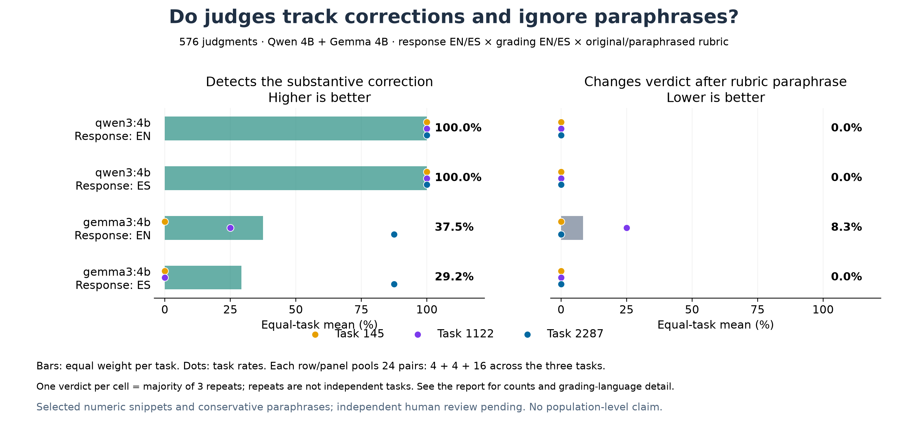
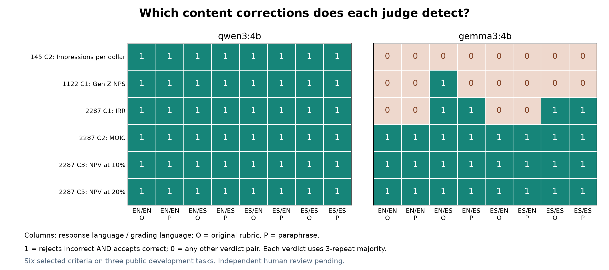

# Contenido, paráfrasis e idioma: resultados locales

Ejecución `content-paraphrase-v1`. **576 juicios válidos**, dos modelos locales, seis criterios numéricos y tres tareas públicas previamente exploradas. Las traducciones y paráfrasis no tienen revisión humana independiente. Los resultados describen controles construidos, no el desempeño profesional de agentes ni el juez de producción de APEX.

## Resultado principal

Cada decisión usa la mayoría de tres repeticiones. Detectar la corrección exige rechazar la respuesta incorrecta y aprobar la correcta. Cambiar por paráfrasis significa alterar la decisión con la respuesta fija. Los porcentajes promedian primero dentro de cada tarea y después entre las tres tareas. Los conteos agrupados se muestran por transparencia; su cociente no define el promedio por tarea.

| Modelo | Respuesta | Detecta corrección, promedio por tarea | Pares detectados, agrupados | Cambia por paráfrasis, promedio por tarea | Pares cambiados, agrupados |
|---|---|---:|---:|---:|---:|
| qwen3:4b | EN | 100.0% | 24/24 | 0.0% | 0/24 |
| qwen3:4b | ES | 100.0% | 24/24 | 0.0% | 0/24 |
| gemma3:4b | EN | 37.5% | 15/24 | 8.3% | 1/24 |
| gemma3:4b | ES | 29.2% | 14/24 | 0.0% | 0/24 |

Una baja tasa de cambios por paráfrasis puede coexistir con fallos de detección. La estabilidad por sí sola no establece corrección.

## Desglose por tarea

| Modelo | Respuesta | Tarea | Detecta corrección | Cambia por paráfrasis | Cambia al evaluar en ES en vez de EN | Errores / llamadas |
|---|---|---|---:|---:|---:|---:|
| qwen3:4b | EN | 1122 | 4/4 | 0/4 | 0/4 | 0/24 |
| qwen3:4b | EN | 145 | 4/4 | 0/4 | 0/4 | 0/24 |
| qwen3:4b | EN | 2287 | 16/16 | 0/16 | 0/16 | 0/96 |
| qwen3:4b | ES | 1122 | 4/4 | 0/4 | 0/4 | 0/24 |
| qwen3:4b | ES | 145 | 4/4 | 0/4 | 0/4 | 0/24 |
| qwen3:4b | ES | 2287 | 16/16 | 0/16 | 0/16 | 0/96 |
| gemma3:4b | EN | 1122 | 1/4 | 1/4 | 1/4 | 9/24 |
| gemma3:4b | EN | 145 | 0/4 | 0/4 | 0/4 | 12/24 |
| gemma3:4b | EN | 2287 | 14/16 | 0/16 | 2/16 | 6/96 |
| gemma3:4b | ES | 1122 | 0/4 | 0/4 | 0/4 | 12/24 |
| gemma3:4b | ES | 145 | 0/4 | 0/4 | 0/4 | 12/24 |
| gemma3:4b | ES | 2287 | 14/16 | 0/16 | 2/16 | 6/96 |

## Idioma de evaluación y redacción

Desglose de detección por cada combinación. El idioma de evaluación cambia rúbrica e instrucciones juntas. Un contraste entre EN y ES no separa esos dos componentes.

| Modelo | Respuesta | Evaluación | Rúbrica | Detecta, promedio por tarea | Pares detectados, agrupados |
|---|---|---|---|---:|---:|
| qwen3:4b | EN | EN | original | 100.0% | 6/6 |
| qwen3:4b | EN | EN | paraphrase | 100.0% | 6/6 |
| qwen3:4b | EN | ES | original | 100.0% | 6/6 |
| qwen3:4b | EN | ES | paraphrase | 100.0% | 6/6 |
| qwen3:4b | ES | EN | original | 100.0% | 6/6 |
| qwen3:4b | ES | EN | paraphrase | 100.0% | 6/6 |
| qwen3:4b | ES | ES | original | 100.0% | 6/6 |
| qwen3:4b | ES | ES | paraphrase | 100.0% | 6/6 |
| gemma3:4b | EN | EN | original | 25.0% | 3/6 |
| gemma3:4b | EN | EN | paraphrase | 25.0% | 3/6 |
| gemma3:4b | EN | ES | original | 66.7% | 5/6 |
| gemma3:4b | EN | ES | paraphrase | 33.3% | 4/6 |
| gemma3:4b | ES | EN | original | 25.0% | 3/6 |
| gemma3:4b | ES | EN | paraphrase | 25.0% | 3/6 |
| gemma3:4b | ES | ES | original | 33.3% | 4/6 |
| gemma3:4b | ES | ES | paraphrase | 33.3% | 4/6 |

## Corrección por llamada y repetibilidad

| Modelo | Respuesta | Falsas aprobaciones / respuestas incorrectas | Falsos rechazos / respuestas correctas | Celdas inestables | Desacuerdo entre repeticiones, promedio por tarea |
|---|---|---:|---:|---:|---:|
| qwen3:4b | EN | 0/72 | 0/72 | 0/48 | 0.0% |
| qwen3:4b | ES | 0/72 | 0/72 | 0/48 | 0.0% |
| gemma3:4b | EN | 27/72 | 0/72 | 0/48 | 0.0% |
| gemma3:4b | ES | 30/72 | 0/72 | 0/48 | 0.0% |

## Dirección de los cambios

Conteos de pares de decisiones por mayoría; un mismo criterio puede aparecer en varias condiciones y contrastes. Estas filas no son tareas independientes y no se deben sumar para formar una tasa única.

| Modelo | Cambio | Pares comparados | Cambios de mayoría | Corrigen error | Introducen error | Cambian fracción de aprobaciones |
|---|---|---:|---:|---:|---:|---:|
| qwen3:4b | Original → paráfrasis | 48 | 0 | 0 | 0 | 0 |
| qwen3:4b | Evaluación EN → ES | 48 | 0 | 0 | 0 | 0 |
| qwen3:4b | Respuesta EN → ES | 48 | 0 | 0 | 0 | 0 |
| gemma3:4b | Original → paráfrasis | 48 | 1 | 0 | 1 | 1 |
| gemma3:4b | Evaluación EN → ES | 48 | 5 | 5 | 0 | 5 |
| gemma3:4b | Respuesta EN → ES | 48 | 1 | 0 | 1 | 1 |

Todos los contrastes, incluidos los ceros, están en [el CSV de pares](content-paraphrase-v1-pairs.csv). La variación de fracciones se reporta aunque no cambie la mayoría; debe leerse junto a la inestabilidad de repeticiones idénticas.

## Casos que cambian con la paráfrasis

| Modelo | Tarea / criterio | Estado | Respuesta | Evaluación | Original → paráfrasis | Efecto |
|---|---|---|---|---|---|---|
| gemma3:4b | 1122 / C1 | incorrect | EN | ES | 0 → 1 | Introduce error |

## Lectura para la propuesta

**qwen3:4b:** 0/288 juicios difieren de la regla numérica. Cambian por paráfrasis 0/48 pares, por idioma de respuesta 0/48 y por idioma de evaluación 0/48.

**gemma3:4b:** 57/288 juicios difieren de la regla numérica. Cambian por paráfrasis 1/48 pares, por idioma de respuesta 1/48 y por idioma de evaluación 5/48.

El aporte de este bloque es comprobar conjuntamente sensibilidad y estabilidad. Si un modelo conserva errores al reformular o traducir, esa consistencia no valida la evaluación. Si otro acierta estos controles, ese resultado debe conservarse aunque no apoye una hipótesis de sensibilidad lingüística.

Los fallos del estudio numérico anterior y el resultado de este bloque corresponden a conjuntos distintos. En particular, en 1122 el Qwen anterior rechazaba los extremos permitidos -29 y -27; este bloque utiliza -28 y -30. No interpretar una mejor tasa aquí como mejora causal por paráfrasis, entrenamiento o adaptación: cambiaron los valores probados. Ver [intervención anterior](Intervención%20numérica%20—%20resultados.md).

## Ejemplos auditables de errores

Se muestra el primer error observado de cada modelo, si existe, en el orden de ejecución. Es un ejemplo ilustrativo; las tasas anteriores incluyen todos los casos.

**qwen3:4b:** ningún error observado en este bloque.

**gemma3:4b — `145-c2-incorrect-es-original:es:r1`**

Criterio: Indica que el promedio de impresiones por $ para el método de pago de precio fijo es 9.15. (El rango aceptable es de 9.05 a 9.25)

Respuesta: El número promedio de impresiones por dólar para el método de pago de precio fijo es 9.26.

Veredicto del modelo: 1; etiqueta de construcción: 0.

Explicación registrada: La respuesta indica que el número promedio de impresiones por dólar para el método de precio fijo es 9.26, lo que está dentro del rango aceptable de 9.05 a 9.25.

## Alcance y trazabilidad

- 576/576 llamadas válidas; 0 intentos fallidos registrados.
- Tres tareas elegidas de forma deliberada, con cuatro criterios en 2287 y uno en cada otra tarea. Los porcentajes macro asignan el mismo peso a las tres tareas.
- Una sola paráfrasis conservadora por criterio e idioma; no representa todas las formas de redactar una rúbrica.
- Los controles correctos usan el nominal y los incorrectos un valor fuera del rango. Este estudio no vuelve a probar todos los extremos de tolerancia del estudio anterior.
- Ocho de las 96 combinaciones de estímulos por modelo reutilizan exactamente prompts del estudio numeric-intervention-v1 (145 y 1122, instrucciones EN y rúbrica original). Son nuevas llamadas sobre controles conocidos, no nuevos ejemplos independientes.
- Los modelos se ejecutaron secuencialmente, Qwen primero. Las condiciones dentro de cada modelo se intercalaron en un orden fijado antes de la inferencia.
- No se ha realizado revisión humana independiente ni inferencia poblacional; las diferencias no establecen un sesgo lingüístico general.

El siguiente paso de validación es revisar equivalencia y adecuación de las respuestas y repetir el diagnóstico sobre una configuración de referencia confirmada con Mercor y respuestas profesionales naturales. Los datos actuales permiten localizar fallos y formular esa solicitud; no elegir una configuración de producción.

Archivos: [protocolo](../proposal/protocols/Contenido%20y%20par%C3%A1frasis%20%E2%80%94%20protocolo.md), [análisis completo](content-paraphrase-v1.json), [celdas](content-paraphrase-v1-cells.csv), [tasas](content-paraphrase-v1-rates.csv), [estímulos congelados Qwen](../runs/content-paraphrase-v1/qwen3-4b/requests.jsonl), [resultados crudos Qwen](../runs/content-paraphrase-v1/qwen3-4b/results.jsonl), [resultados crudos Gemma](../runs/content-paraphrase-v1/gemma3-4b/results.jsonl).
