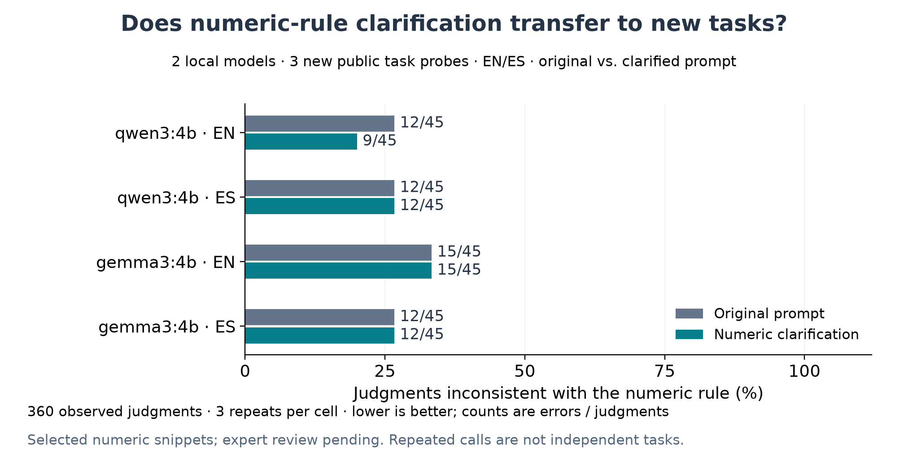

# ¿Podemos mejorar al juez en tareas nuevas?

Se completaron 360 juicios locales válidos. Intentos fallidos: 0. Se comparó el prompt original con una aclaración congelada de reglas numéricas, usando Qwen 4B y Gemma 4B en tres tareas públicas no utilizadas en las corridas previas.

La intervención indica que los extremos de los intervalos son válidos, que los valores fuera no deben aprobarse por cercanía y que el formato equivalente no autoriza cambios de valor. No incluye respuestas resueltas ni etiquetas esperadas. Los mismos estímulos se evaluaron bajo ambas condiciones, intercaladas aleatoriamente.



## Resultados por modelo e idioma

Cada condición tiene 45 juicios: 27 sobre valores aceptables y 18 sobre valores incorrectos. Se muestran todos los resultados, incluidos posibles aumentos de error.

| Modelo | Idioma | Errores original → aclarado | Aprobaciones incorrectas original → aclarado | Rechazos incorrectos original → aclarado |
|---|---|---:|---:|---:|
| qwen3:4b | EN | 12/45 → 9/45 | 6/18 → 3/18 | 6/27 → 6/27 |
| qwen3:4b | ES | 12/45 → 12/45 | 6/18 → 6/18 | 6/27 → 6/27 |
| gemma3:4b | EN | 15/45 → 15/45 | 9/18 → 9/18 | 6/27 → 6/27 |
| gemma3:4b | ES | 12/45 → 12/45 | 6/18 → 6/18 | 6/27 → 6/27 |

## Transferencia por tarea

Estos casos son nuevos para nuestras corridas; sus rúbricas públicas fueron inspeccionadas para construir los estímulos. No son datos ocultos ni una muestra aleatoria.

| Modelo | Tarea | Idioma | Errores original → aclarado |
|---|---|---|---:|
| qwen3:4b | 145 | EN | 0/15 → 0/15 |
| qwen3:4b | 145 | ES | 0/15 → 0/15 |
| qwen3:4b | 1122 | EN | 6/15 → 6/15 |
| qwen3:4b | 1122 | ES | 6/15 → 6/15 |
| qwen3:4b | 2205 | EN | 6/15 → 3/15 |
| qwen3:4b | 2205 | ES | 6/15 → 6/15 |
| gemma3:4b | 145 | EN | 6/15 → 6/15 |
| gemma3:4b | 145 | ES | 3/15 → 3/15 |
| gemma3:4b | 1122 | EN | 3/15 → 3/15 |
| gemma3:4b | 1122 | ES | 3/15 → 3/15 |
| gemma3:4b | 2205 | EN | 6/15 → 6/15 |
| gemma3:4b | 2205 | ES | 6/15 → 6/15 |

## Mejoras y regresiones por celda

Una celda es un estímulo/idioma con tres repeticiones. Se compara la mayoría de etiquetas con el predicado de diseño. Las tasas anteriores conservan las tres llamadas; estas mayorías son un resumen complementario.

| Modelo | Celdas de mayoría incorrecta a correcta | De correcta a incorrecta | Celdas comparadas |
|---|---:|---:|---:|
| qwen3:4b | 1 | 0 | 30 |
| gemma3:4b | 0 | 0 | 30 |

## Interpretación

El resultado evalúa una candidata de configuración fuera de los ejemplos que motivaron su diseño. Debe leerse por modelo, idioma y tarea: una reducción promedio no compensa automáticamente una regresión en un criterio relevante. No se ajustó la enmienda después de ver estos resultados.

La referencia es la pertenencia al intervalo publicado. Durante la corrida se verificaron dos blancos desde los CSV: 145 C2 da 9,14544 impresiones por dólar (9,15 redondeado) y 1122 C1 da NPS -27,83505 (-28 redondeado). Esta comprobación no cambió el plan; el rendimiento del bono de 2205 sigue basado en la rúbrica. No hay revisión lingüística o profesional independiente. Son frases de un criterio, no entregables completos. Tres tareas elegidas no permiten estimar prevalencia, significancia o fiabilidad de producción. La intervención incluye varias aclaraciones y añade texto; no identifica cuál frase produce un cambio.

El siguiente paso es validar pares y etiquetas, incorporar respuestas naturales de agentes y comparar con una configuración de referencia confirmada por Mercor. Si una candidata mejora, debe pasar por un conjunto nuevo más amplio con criterios de aceptación acordados antes de su evaluación.

## Reproducir

```sh
python3 scripts/numeric_intervention.py report
.venv/bin/python scripts/plot_intervention.py
python3 scripts/report_intervention.py
```

- [Protocolo congelado](../proposal/protocols/Intervenci%C3%B3n%20num%C3%A9rica%20%E2%80%94%20protocolo.md).
- [Resumen completo](numeric-intervention-v1.json), [celdas](numeric-intervention-v1-cells.csv), [tasas por tarea](numeric-intervention-v1-rates.csv), [mejoras y regresiones](numeric-intervention-v1-paired_changes.csv).
- Registros: `runs/numeric-intervention-v1/`, con manifiestos, solicitudes, respuestas y hashes de pesos.
- Petición concreta de recursos a Mercor. Documento preparado, no enviado.

- [Cálculos independientes adicionales](followup_source_checks.json) y paquete de revisión pendiente.
